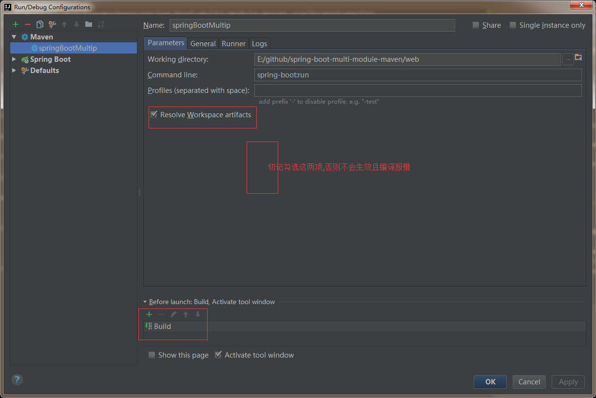
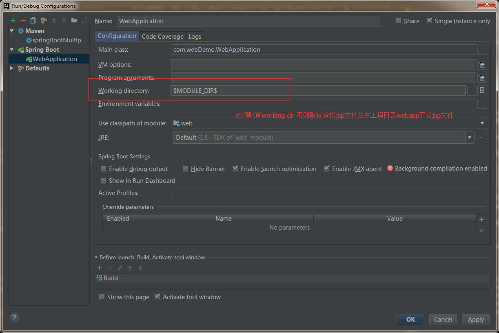

.. image:: https://travis-ci.org/xiaomozhang/spring-boot-multi-module-maven.svg?branch=master
   :target: https://travis-ci.org/xiaomozhang/spring-boot-multi-module-maven

spring-boot-multi-module-maven
~~~~~~~~~~~~

这个是一个多模块maven项目. 模块包含了api和web.

使用spring boot方式运行:

(1)清除并编译当前文件夹
  webDemoProject>mvn clean install
(2)idea配置sringboot编译启动

然后启动完成没有报错;在浏览器中输入 localhost:8080
~~~~~~~~~~~~~~
踩过的坑或注意事项
~~~~~~~~~~~~~~
1、spring boot打包插件兼容性
   spring-boot-maven-plugin 1.5.10版本的打包控件打出来的jar包是无法访问jsp的，直接404，即使你的jsp文件打包进去了。
   
   spring-boot-maven-plugin 1.4.2版本就是可以的，我不知道这两个版本打包控件有什么区别，有知道的大神可以讲讲。

2、web jar包配置(pom)
  (1)<packaging>jar</packaging>
  (2)build maven插件
  
  
  <build>
             <plugins>
                 <plugin>
                     <groupId>org.springframework.boot</groupId>
                     <artifactId>spring-boot-maven-plugin</artifactId>
                     <version>1.4.2.RELEASE</version>
                     <configuration>
                         <!--<classifier>exec</classifier>-->
                         <mainClass>com.webDemo.WebApplication</mainClass>
                         <jvmArguments>-Dfile.encoding=UTF-8 -Xdebug -Xrunjdwp:transport=dt_socket,server=y,suspend=n,address=5005</jvmArguments>
                         <layout>JAR</layout> <!--选择性配置,可配可不配,不配默认根据packaging类型选择性选取spring boot启动程序包工具类-->
                     </configuration>
                     <executions>
                         <execution>
                             <goals>
                                 <goal>repackage</goal><!--可以把依赖的包都打包到生成的Jar包中-->
                             </goals>
                         </execution>
                     </executions>
                     <dependencies>
                         <!-- spring热部署 -->
                         <dependency>
                             <groupId>org.springframework</groupId>
                             <artifactId>springloaded</artifactId>
                             <version>1.2.5.RELEASE</version>
                         </dependency>
                     </dependencies>
                 </plugin>
                 <plugin>
                     <groupId>org.apache.maven.plugins</groupId>
                     <artifactId>maven-surefire-plugin</artifactId>
                     <configuration>
                         <useSystemClassLoader>false</useSystemClassLoader>
                     </configuration>
                 </plugin>
                 <!-- 忽略无web.xml警告 -->
                 <plugin>
                     <groupId>org.apache.maven.plugins</groupId>
                     <artifactId>maven-war-plugin</artifactId>
                     <configuration>
                         <failOnMissingWebXml>false</failOnMissingWebXml>
                     </configuration>
                 </plugin>
             </plugins>
             <resources>
                 <!-- 打包时将jsp文件拷贝到META-INF目录下-->
                 <resource>
                     <!-- 指定resources插件处理哪个目录下的资源文件 -->
                     <directory>src/main/webapp</directory>
                     <!--注意此次必须要放在此目录下才能被访问到-->
                     <targetPath>META-INF/resources</targetPath>
                     <includes>
                         <include>**/**</include>
                     </includes>
                 </resource>
                 <resource>
                     <directory>src/main/resources</directory>
                     <includes>
                         <include>**/**</include>
                     </includes>
                     <filtering>false</filtering>
                 </resource>
                 <resource>
                     <directory>src/main/java</directory>
                     <excludes>
                         <exclude>**/*.java</exclude>
                     </excludes>
                 </resource>
             </resources>
         </build>
         

3、web war包配置(pom)
  (1)<packaging>war</packaging>
  (2)build maven 插件
  <build>
          <plugins>
              <plugin>
                  <groupId>org.springframework.boot</groupId>
                  <artifactId>spring-boot-maven-plugin</artifactId>
                  <version>1.4.2.RELEASE</version>
                  <configuration>
                      <!--<classifier>exec</classifier>-->
                      <mainClass>com.webDemo.WebApplication</mainClass>
                      <jvmArguments>-Dfile.encoding=UTF-8 -Xdebug -Xrunjdwp:transport=dt_socket,server=y,suspend=n,address=5005</jvmArguments>
                      <layout>WAR</layout> <!--选择性配置,可配可不配,不配默认根据packaging类型选择性选取spring boot启动程序包工具类-->
                  </configuration>
                  <executions>
                      <execution>
                          <goals>
                              <goal>repackage</goal><!--可以把依赖的包都打包到生成的Jar包中-->
                          </goals>
                      </execution>
                  </executions>
                  <dependencies>
                      <!-- spring热部署 -->
                      <dependency>
                          <groupId>org.springframework</groupId>
                          <artifactId>springloaded</artifactId>
                          <version>1.2.5.RELEASE</version>
                      </dependency>
                  </dependencies>
              </plugin>
              <plugin>
                  <groupId>org.apache.maven.plugins</groupId>
                  <artifactId>maven-surefire-plugin</artifactId>
                  <configuration>
                      <useSystemClassLoader>false</useSystemClassLoader>
                  </configuration>
              </plugin>
              <!-- 忽略无web.xml警告 -->
              <plugin>
                  <groupId>org.apache.maven.plugins</groupId>
                  <artifactId>maven-war-plugin</artifactId>
                  <configuration>
                      <failOnMissingWebXml>false</failOnMissingWebXml>
                  </configuration>
              </plugin>
          </plugins>
      </build>

4、idea run as运行配置

